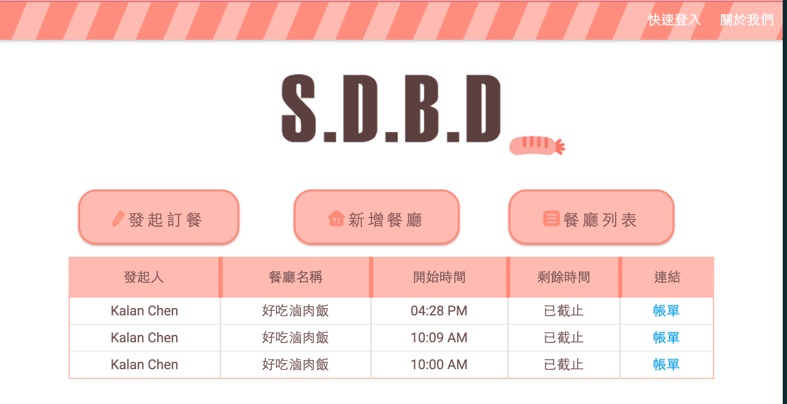
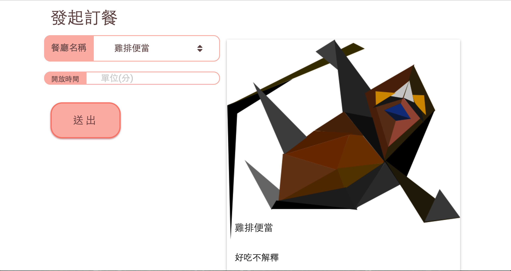

### SUDO-DBD ###
===
**目前暫時關閉，預計於今年 12 月份進行重構**

** Why DBD **：讓點餐這件事情變得更方便。

### 10 / 9 版本更新紀錄：
* 每一位使用者現在都可以刪除、修改有問題的餐廳。
* 使用者現在可以在餐廳的新增評論，並且給予評分。
* 餐廳可以依照評分的高低來排序
* 點餐時可以將圖片放大，比較好看到餐點名稱跟價格
* 發起點餐的時候可以看到菜單給點餐的人確認
* 發起點餐時，可以顯示簡介給發起人看
* 結帳的時候可以看到菜單，沒有寫上價格的人可以馬上確認確切價格為多少
* 修正圖片跑版問題

===

### Demo

