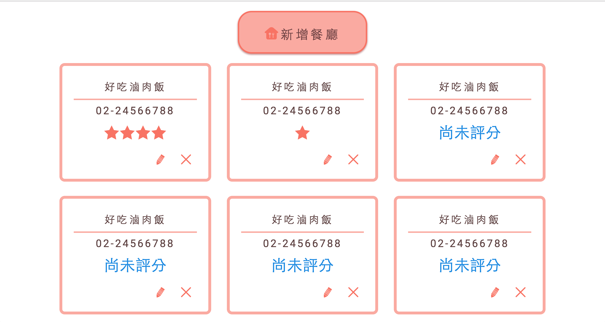
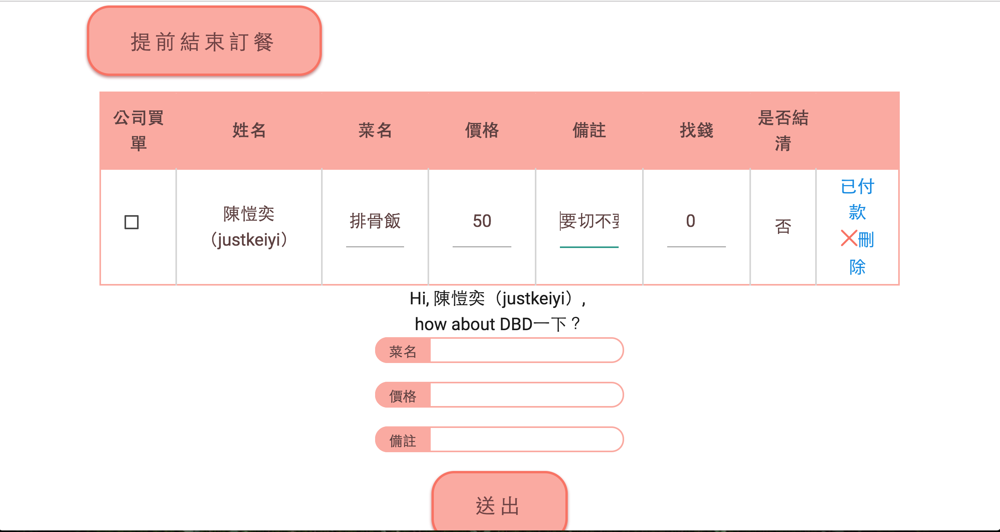

### SUDO-DBD ###
===
**目前暫時關閉，預計於今年 12 月份進行重構**

### Why DBD

[Slides By Denny](http://www.slideshare.net/dennyku1/sdbd-52472582)

1. 新增餐廳，並能夠為餐廳評價，自己的公司將會有自己的美食地圖
2. 每次都有人拖很久才訂餐？每筆訂單將有倒數計時機制，訂便當的人最大！
3. 對訂餐者友善的介面，找錢、付款，還是公司買單？統一在訂單上操作，再也不會忘記收錢。
4. 每個使用者將有自己的介面紀錄每月花費
5. slack 上加入訂便當機器人

### 10 / 9 版本更新紀錄：

* 每一位使用者現在都可以刪除、修改有問題的餐廳。
* 使用者現在可以在餐廳的新增評論，並且給予評分。
* 餐廳可以依照評分的高低來排序
* 點餐時可以將圖片放大，比較好看到餐點名稱跟價格
* 發起點餐的時候可以看到菜單給點餐的人確認
* 發起點餐時，可以顯示簡介給發起人看
* 結帳的時候可以看到菜單，沒有寫上價格的人可以馬上確認確切價格為多少
* 修正圖片跑版問題

===

### Demo

## Thanks

- [Bleeki](https://www.linkedin.com/in/%E4%BA%A6%E6%99%B4-%E6%96%BD-391701b9?authType=NAME_SEARCH&authToken=HY42&locale=zh_TW&trk=tyah&trkInfo=clickedVertical%3Amynetwork%2CclickedEntityId%3A422767837%2CauthType%3ANAME_SEARCH%2Cidx%3A1-1-1%2CtarId%3A1477033648146%2Ctas%3A%E6%96%BD%E4%BA%A6%E6%99%B4) 設計版面
- [Denny Ku](https://github.com/abalone0204) 協助開發與指導